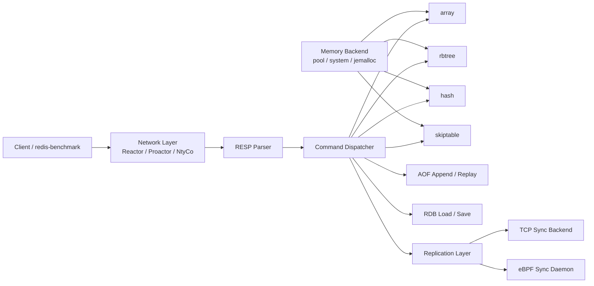
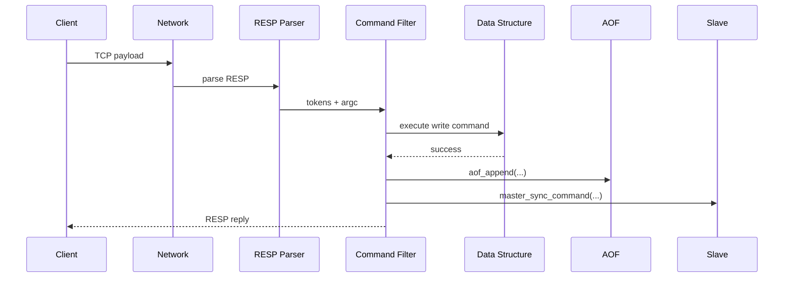
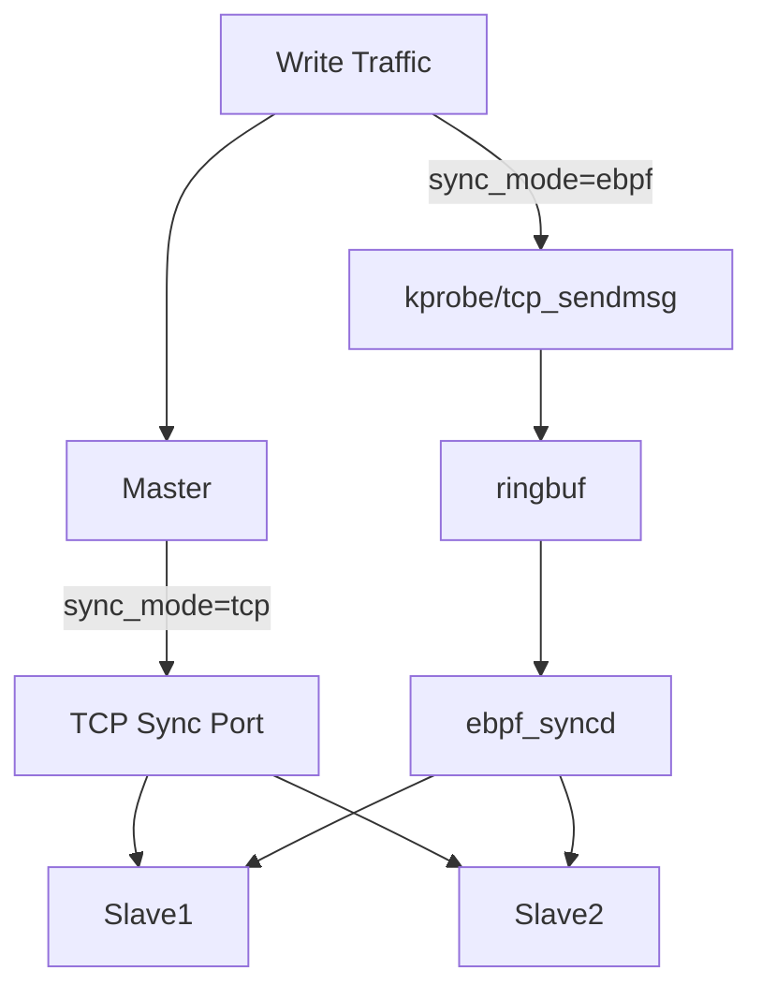

## KVStore

类 Redis 的轻量级 KV 引擎，支持多数据结构、RESP 协议、AOF/RDB 持久化，以及 TCP/eBPF 两种主从同步链路。

---

## 1. 项目定位

可落地运行的 C 语言 KV 内存数据库，覆盖“协议解析 -> 存储引擎 -> 持久化 -> 主从复制 -> 压测体系”的完整链路，并通过统一脚本对比 Redis 进行性能验证。

**核心职责/成果：**

- 设计并实现四种数据结构引擎：`array / rbtree / hash / skiptable`
- 完成 RESP 协议解析、Pipeline 支持与命令分发
- 实现 AOF/RDB 持久化和重放恢复
- 实现主从同步（`sync_mode=tcp|ebpf`）
- 统一压测框架（同口径对比 KVStore 与 Redis）、自定义读写、自定义内存池虚拟内存占用、自定义eBPF同步链路压测

---

## 2. 技术栈

- **语言与系统**：C、Linux、epoll、io_uring、pthread
- **协议与网络**：RESP、TCP、Pipeline
- **存储与内存**：自定义内存池、glibc malloc、jemalloc 可切换
- **持久化**：AOF（含 fsync 策略、aof_rewrite重写）、RDB
- **复制**：Master-Slave（TCP / eBPF）
- **工程化**：统一配置、自动化压测脚本

---

## 3. 架构设计

### 3.1 总体架构图



### 3.2 请求处理时序图（写命令）



### 3.3 主从同步架构图（TCP / eBPF）



---

## 4. 模块划分

| 模块      | 路径                             | 说明                                                         |
| --------- | -------------------------------- | ------------------------------------------------------------ |
| 核心入口  | `src/core/kvstore.c`             | 配置加载、全局初始化、启动网络与优雅退出                     |
| 协议解析  | `src/network/resp_protocol.c`    | RESP 命令探测、解析、状态机                                  |
| 存储引擎  | `src/storage/`                   | array/rbtree/hash/skiptable 实现                             |
| 持久化    | `src/persistence/`               | AOF/RDB 读写、重放、重写                                     |
| TCP 复制  | `src/distributed/`               | 全量 + 增量同步                                              |
| eBPF 复制 | `src/eBPF/ebpf_syncd.c`          | 抓取 master 流量并广播到 slave                               |
| 压测体系  | `scripts/bench_all.sh`、`test/*` | 标准对齐压测（KVStore vs Redis）+ 自定义压测（读写负载、内存后端对比、eBPF同步链路） |

---

## 5. 关键代码片段

- 一致性：写命令何时落盘、何时同步、如何避免回放重复写。
- 正确性：协议半包/脏数据如何处理，参数非法如何快速失败。
- 并发与隔离：主从线程上下文如何隔离，slave 连接风暴如何保护。
- 工程化：配置优先级如何保证、内存后端如何按场景切换。
- 性能：eBPF 链路如何做批处理降低 syscall 开销。

下列片段均来自当前仓库真实实现。

### 5.1 写命令：执行后落盘 + 同步（`src/core/kvstore.c`）

```c
if(ret >= 0 && cmd->write_command){
#if ENABLE_AOF
    if(!aof_is_loading()){
        aof_append(count, tokens);
    }
#endif

    if(get_sync_context() != 2){
        if (global_dist_config.role == ROLE_MASTER && g_cfg.sync_mode == KVS_SYNC_TCP) {
            master_sync_command(tokens[0], tokens[1], (count > 2) ? tokens[2] : NULL);
        }
    }
}
```

相关源码：

- `src/core/kvstore.c`：`kvs_filter_protocol`
- `src/persistence/kvs_aof.c`：`aof_append`
- `src/distributed/distributed.c`：`master_sync_command`

### 5.2 配置优先级：默认值 -> 配置文件 -> 命令行覆盖（`src/core/kvstore.c`）

```c
kvs_config_init_default(&g_cfg);
const char *config_path = NULL;
kvs_config_apply_cmdline(&g_cfg, argc, argv, &config_path);

if (config_path) {
    kvs_config_load_file(&g_cfg, config_path);
} else {
    kvs_config_load_file(&g_cfg, "config/kvstore.conf");
}

// 二次应用命令行，确保 CLI 优先级最高
kvs_config_apply_cmdline(&g_cfg, argc, argv, NULL);
```

相关源码：

- `src/core/kvstore.c`：`main`
- `src/core/kvs_config.c`：`kvs_config_init_default` / `kvs_config_load_file` / `kvs_config_apply_cmdline`

### 5.3 RANGE/SORT 参数校验（`src/core/kvs_operation.c`）

```c
if(strcmp(cmd->name, "RRANGE") == 0 || strcmp(cmd->name, "SRANGE") == 0){
    return argc == 3 || argc == 5;
}

if(strcmp(cmd->name, "SORT") == 0 || strcmp(cmd->name, "RSORT") == 0 ||
   strcmp(cmd->name, "HSORT") == 0 || strcmp(cmd->name, "SSORT") == 0){
    return argc >= min_args && argc <= 3;
}
```

相关源码：

- `src/core/kvs_operation.c`：`check_arity`
- `src/core/kvs_operation.c`：`parse_command_argument`
- `src/core/kvs_operation.c`：`handle_range` / `handle_sort`

```c
if (count == 5) {
    if (strcasecmp(tokens[3], "LIMIT") != 0) return -1;
    parsed_limit = strtol(tokens[4], &endptr, 10);
    if (endptr == tokens[4] || *endptr != '\0' || parsed_limit <= 0) return -1;
    ctx->limit = (int)parsed_limit;
}
```

### 5.4 从节点只读保护（`src/core/kvstore.c`）

```c
if (cmd->write_command && global_dist_config.role == ROLE_SLAVE && get_sync_context() == 0){
    return resp_generate_error(response, "ERROR SLAVE READ ONLY");
}
```

相关源码：

- `src/core/kvstore.c`：`kvs_filter_protocol`
- `src/core/kvstore.c`：`set_sync_context` / `get_sync_context`

### 5.5 主节点全量同步（`src/distributed/distributed.c`）

```c
#if ENABLE_ARRAY
for (int i = 0; i < global_array.total; i++) {
    if (global_array.table[i].key && global_array.table[i].value) {
        master_sync_command("SET", global_array.table[i].key, global_array.table[i].value);
    }
}
#endif
```

相关源码：

- `src/distributed/distributed.c`：`slave_sync_thread`
- `src/distributed/distributed.c`：`master_sync_server`

### 5.6 eBPF 批处理发送（`src/eBPF/ebpf_syncd.c`）

```c
tx_batcher_init(&ctx->txb,
                ctx->tx_buf, sizeof(ctx->tx_buf),
                FLUSH_NS,
                txb_send_fn, ctx);

if (tx_batcher_append(&ctx->txb, msg->data, msg->len) < 0) {
    close(ctx->fd);
    ctx->fd = -1;
}
```

相关源码：

- `src/eBPF/ebpf_syncd.c`：`slave_sender_worker`
- `src/utils/tx_batcher.c`：`tx_batcher_init` / `tx_batcher_append` / `tx_batcher_flush`

### 5.7 RESP 半包/非法包处理（`src/network/resp_protocol.c`）

```c
if (!buf || offset >= len) return 0;
...
if (*p != '*') return -1;
...
if (array_len < 0 || array_len > MAX_ARRAY_LENGTH) return -1;
...
if (remain < need) return 0; // 半包，继续收包
if (p[bulk_len] != '\r' || p[bulk_len + 1] != '\n') return -1;
```

`0` 表示“数据不够”（继续读），`-1` 表示“协议错误”（快速失败），可避免连接状态机混乱。

相关源码：

- `src/network/resp_protocol.c`：`resp_peek_command`
- `src/network/resp_protocol.c`：`resp_parser`

### 5.8 复制上下文隔离（`src/core/kvstore.c`）

```c
static __thread int sync_context = 0;

void set_sync_context(int context) { sync_context = context; }
int get_sync_context() { return sync_context; }
```

```c
if (cmd->write_command && global_dist_config.role == ROLE_SLAVE && get_sync_context() == 0){
    return resp_generate_error(response, "ERROR SLAVE READ ONLY");
}
```

通过线程局部变量区分“客户端写请求”与“复制回放请求”，保证 slave 对外只读但可应用主节点增量。

相关源码：

- `src/core/kvstore.c`：`sync_context`（`__thread`）
- `src/core/kvstore.c`：`set_sync_context` / `get_sync_context`
- `src/distributed/distributed.c`：slave 侧回放命令路径（复制上下文设置）
- `src/network/reactor.c` / `src/network/proactor.c` / `src/network/ntyco.c`：复制连接上下文切换（`set_sync_context(2)`）

### 5.9 Slave 连接并发保护（`src/distributed/distributed.c`）

```c
pthread_mutex_lock(&global_dist_config.slave_mutex);
if(global_dist_config.slave_count < global_dist_config.max_slaves){
    ...
    global_dist_config.slaves[global_dist_config.slave_count++] = *slave;
    pthread_create(&slave->thread, NULL, slave_sync_thread, slave);
}else{
    close(client_fd);
    printf("Max slave reached, connection refused\n");
}
pthread_mutex_unlock(&global_dist_config.slave_mutex);
```

互斥锁保护 slave 列表与计数， `max_slaves` 上限避免连接风暴导致资源失控。

相关源码：

- `src/distributed/distributed.c`：`master_sync_server`
- `src/distributed/distributed.c`：`distributed_shutdown`

### 5.10 内存后端策略切换（`src/core/kvstore.c`）

```c
if(g_cfg.mem_backend == KVS_MEM_BACKEND_JEMALLOC){
    mem_set_backend(KVS_MEM_BACKEND_JEMALLOC);
    mem_set_jemalloc_funcs(jemalloc_alloc_impl, jemalloc_free_impl, jemalloc_realloc_impl);
}else if(g_cfg.mem_backend == KVS_MEM_BACKEND_SYSTEM){
    mem_set_backend(KVS_MEM_BACKEND_SYSTEM);
}else{
    mem_set_backend(KVS_MEM_BACKEND_POOL);
}
```

同一业务路径可在 `pool/system/jemalloc` 间切换，用于验证不同内存后端。

相关源码：

- `src/core/kvstore.c`：`main`（后端选择逻辑）

- `src/storage/kvs_mempool.c`：`mem_set_backend` / `mem_init` / `mem_destroy`
- `src/storage/jemalloc_wrapper.c`：`jemalloc_*_impl`

---

## 6. 性能报告

### 6.1 标准对齐压测（KVStore vs Redis）

- 压测工具：`redis-benchmark`
- 二进制路径：`/usr/local/bin/redis-benchmark`
- 版本：`redis-benchmark 6.2.21 (git:578ac274)`
- 对齐范围：`populate / set / get`（KVStore 与 Redis 使用同一工具与同口径参数，仅目标地址不同）
- 参数口径：`-c 50 -n 100000 -P 1 -d 32 -r 100000`

| ds        |   op |  kvstore_qps |     redis_qps | kv/redis |
| --------- | ---: | -----------: | ------------: | -------: |
| array     |  set |  1226.890000 | 108577.630000 |    0.011 |
| array     |  get |  1191.280000 | 129032.270000 |    0.009 |
| rbtree    |  set | 95785.440000 | 121802.680000 |    0.786 |
| rbtree    |  get | 94786.730000 | 112359.550000 |    0.844 |
| hash      |  set | 88967.980000 | 123001.230000 |    0.723 |
| hash      |  get | 90579.710000 | 124378.110000 |    0.728 |
| skiptable |  set | 88495.580000 | 122699.390000 |    0.721 |
| skiptable |  get | 93632.960000 | 121802.680000 |    0.769 |

- 当前瓶颈集中在 `array` 路径（最低 `array/get = 1191.28 qps`）
- `rbtree/hash/skiptable` 的 `set/get` 已进入高吞吐区间，与 Redis 差距显著缩小
- TCP 主从模式下吞吐损耗较小；eBPF 模式在启用批处理后，吞吐显著优于无批处理路径
- 后续优化优先级：`array` 路径、eBPF 大包与分片处理、内存后端按场景调优

> 原始数据：`results/raw.csv`  
> 汇总报告：`results/summary.md`

### 6.2 自定义压测数据：单机 vs 主从同步（TCP）

注：该组数据均为 `100000` 次写入，且测试时关闭 AOF。

| Mode         | Structure | count  | QPS      |
| ------------ | --------- | ------ | -------- |
| Standalone   | array     | 100000 | 17668.08 |
| Standalone   | rbtree    | 100000 | 16593.61 |
| Standalone   | hash      | 100000 | 16897.22 |
| Standalone   | skiptable | 100000 | 17324.24 |
| Master-Slave | array     | 100000 | 17156.03 |
| Master-Slave | rbtree    | 100000 | 16055.72 |
| Master-Slave | hash      | 100000 | 16452.01 |
| Master-Slave | skiptable | 100000 | 16559.29 |

### 6.3 自定义压测数据：单机 vs 主从同步（eBPF）

| Mode         | Structure | count  | QPS                  |
| ------------ | --------- | ------ | -------------------- |
| Standalone   | array     | 100000 | 17668.08             |
| Standalone   | rbtree    | 100000 | 16593.61             |
| Standalone   | hash      | 100000 | 16897.22             |
| Standalone   | skiptable | 100000 | 17324.24             |
| Master-Slave | array     | 100000 | 11761.18（无批处理） |
| Master-Slave | rbtree    | 100000 | 11496.70（无批处理） |
| Master-Slave | hash      | 100000 | 11455.85（无批处理） |
| Master-Slave | skiptable | 100000 | 11270.69（无批处理） |
| Master-Slave | array     | 100000 | 15063.18（批处理）   |
| Master-Slave | rbtree    | 100000 | 15041.32（批处理）   |
| Master-Slave | hash      | 100000 | 15231.43（批处理）   |
| Master-Slave | skiptable | 100000 | 15179.61（批处理）   |

### 6.4 eBPF 批处理佐证（send_all 统计）

- 无批处理：每次发送通常对应一条小同步指令，`avg` 约 30B，系统调用频繁。
- 批处理：多条同步指令聚合后再发，`avg` 提升到 128KB（`131072`），系统调用次数显著下降。

| 场景     | send_all calls |  send_all bytes | send_all avg (B) |
| -------- | -------------: | --------------: | ---------------: |
| 无批处理 |   8281 ~ 13553 | 256711 ~ 420143 |      31.0 ~ 31.8 |
| 批处理   |          3 ~ 5 | 393216 ~ 655360 |         131072.0 |

### 6.5 自定义压测数据：不同内存后端对比

**基础功能（pool / system / jemalloc）**

| BACKEND  | PATTERN        | maxrss (KB) | QPS / OPS                      |
| -------- | -------------- | ----------- | ------------------------------ |
| POOL     | small-fixed    | 210576      | qps-small = 27027027.03        |
| POOL     | mid-fixed      | 210576      | read-heavy-small = 24005840    |
| POOL     | big-after-frag | 1029412     | time = 0 ms                    |
| SYSTEM   | small-fixed    | 10176       | qps-small = 26315789.47        |
| SYSTEM   | mid-fixed      | 52416       | read-heavy-small = 46167076.92 |
| SYSTEM   | big-after-frag | 1068024     | time = 0 ms                    |
| JEMALLOC | small-fixed    | 10188       | qps-small = 25641025.64        |
| JEMALLOC | mid-fixed      | 52428       | read-heavy-small = 49996000    |
| JEMALLOC | big-after-frag | 1068036     | time = 0 ms                    |

**混合写删负载（2次写入 → 1次删除 → 间隔后再写入1次 → 最后删除2次）的QPS、虚拟内存占用对比**

| Backend  | Structure | n      | total_ops | QPS (ops/s) | 虚拟内存占用 (GB) |
| -------- | --------- | ------ | --------- | ----------- | ----------------- |
| pool     | array     | 100000 | 600000    | 18085.46    | 1.88              |
| pool     | rbtree    | 100000 | 600000    | 16750.64    | 1.88              |
| pool     | hash      | 100000 | 600000    | 17039.22    | 1.88              |
| pool     | skiptable | 100000 | 600000    | 17490.27    | 1.88              |
| system   | array     | 100000 | 600000    | 17234.81    | 1.96              |
| system   | rbtree    | 100000 | 600000    | 17415.63    | 1.96              |
| system   | hash      | 100000 | 600000    | 17502.00    | 1.96              |
| system   | skiptable | 100000 | 600000    | 17021.75    | 1.96              |
| jemalloc | array     | 100000 | 600000    | 17750.15    | 1.95              |
| jemalloc | rbtree    | 100000 | 600000    | 17342.31    | 1.95              |
| jemalloc | hash      | 100000 | 600000    | 17684.56    | 1.95              |
| jemalloc | skiptable | 100000 | 600000    | 17790.69    | 1.95              |

---

## 7. 压测复现步骤

### 7.1 依赖准备

```bash
# 必需工具
which redis-benchmark
redis-benchmark --version
python3 --version
```

### 7.2 编译项目

```bash
git submodule init
git submodule update 
make 
```

### 7.3 启动待测服务

```bash
# KVStore
./kvstore --config config/master.conf

# Redis（示例）
redis-server --port 6379
```

### 7.4 一键启动

```bash
KV_HOST=127.0.0.1 KV_PORT=9300 \
REDIS_HOST=127.0.0.1 REDIS_PORT=6379 \
C=50 N=100000 POP_N=100000 P=1 KEYSPACE=100000 VALUE_SIZE=32 \
scripts/bench_all.sh
```

### 7.5 结果产物

- 原始明细：`results/raw.csv`
- 汇总报告：`results/summary.md`
- 执行日志：`logs/`

### 7.6 对齐说明

- `set/get/populate`：同工具（`redis-benchmark`）同参数口径对齐
- `range/sort`：KVStore 与 Redis 语义不完全一致，报告中标记为 **not aligned**，用于 KVStore 内部分析

### 7.7 自定义压测复现命令

以下命令用于复现本 README 中“自定义压测数据”部分。

1) **单机写入 QPS（四种结构）**

```bash
./tests/write_qps_test 127.0.0.1 9300 5 100000
```

2) **主从一致性功能验证（TCP/eBPF 均可复用）**

```bash
# mode 6~9: array / rbtree / hash / skiptable 主从一致性
./tests/testcase 127.0.0.1 9300 6 127.0.0.1 9301
./tests/testcase 127.0.0.1 9300 7 127.0.0.1 9301
./tests/testcase 127.0.0.1 9300 8 127.0.0.1 9301
./tests/testcase 127.0.0.1 9300 9 127.0.0.1 9301
```

3) **自定义混合写删负载（对应 6.5 第二张表）**

```bash
# mode=7: 2次写入 -> 1次删除 -> 间隔后再写入1次 -> 最后删除2次
./tests/write_qps_test 127.0.0.1 9300 7 100000
```

4) **eBPF 同步链路复现（先启动 master/slave，再启动 ebpf_syncd）**

```bash
./kvstore --config config/master.conf
./kvstore --config config/slave.conf
sudo ./src/eBPF/ebpf_syncd config/ebpf_sync.conf

# 在 master 侧打压
./tests/write_qps_test 127.0.0.1 9300 5 100000
```

5) **不同内存后端对比（pool/system/jemalloc）**

```bash
# 分别替换 mem_backend=pool|system|jemalloc 后重启服务，再执行同一压测命令
./kvstore --config config/master.conf
./tests/write_qps_test 127.0.0.1 9300 7 100000
```

---

## 8. 功能与命令覆盖

### 8.1 基础命令族

- array：`SET/GET/DEL/MOD/EXIST/RANGE/SORT`
- rbtree：`RSET/RGET/RDEL/RMOD/REXIST/RRANGE/RSORT`
- hash：`HSET/HGET/HDEL/HMOD/HEXIST/HRANGE/HSORT`
- skiptable：`SSET/SGET/SDEL/SMOD/SEXIST/SRANGE/SSORT`

### 8.2 其他命令

- 大 value：`PAPERSET/PAPERGET/PAPERMOD/PAPERDEL`
- 连接控制：`QUIT`

### 8.3 RANGE / SORT 参数支持

#### RANGE 家族

- `RANGE startKey endKey`（array）
- `HRANGE startKey endKey`（hash）
- `RRANGE startKey eney [LIMIT k]]`（rbtree）
- `SRANGE startKey endKey [LIMIT k]`（skiptable）

参数规则：

- `RANGE/HRANGE` 固定 3 个参数（含命令名），不支持 `LIMIT`。
- `RRANGE/SRANGE` 仅支持两种参数个数：`3` 或 `5`。
- 当使用 `LIMIT` 时，格式必须是 `... LIMIT k`，其中 `k` 必须为正整数；否则返回参数错误。
- `RRANGE/SRANGE` 不带 `LIMIT` 时返回整个命中区间；带 `LIMIT` 时返回前 `k` 条（按升序区间遍历顺序）。

#### SORT 家族

- `SORT [high|low] [limit]`
- `RSORT [high|low] [limit]`
- `HSORT [high|low] [limit]`
- `SSORT [high|low] [limit]`

参数规则：

- 默认排序方向：`low`（升序）。
- `high` 表示降序，`low` 表示升序。
- `limit` 为可选正整数；`<=0` 或无法解析时按“不限制条数”处理。
- 不带任何参数时等价于 `low` 且不限制条数。

#### 比较语义

- 四种结构的 `RANGE/SORT` 均基于 `strcmp` 的字典序比较 key。
- 若希望获得数值顺序，建议使用 zero-pad key（如 `key_000001`）。

---

## 9. 项目亮点

- **端到端数据库工程能力**：从 RESP 协议解析、命令分发、存储引擎到持久化与主从复制，形成完整可运行闭环。
- **多存储结构统一抽象**：array / rbtree / hash / skiptable 在统一命令框架下实现，便于横向性能对比与能力扩展。
- **持久化链路完整**：支持 RDB + AOF（含 fsync 策略），覆盖冷启动恢复与运行期写入日志，兼顾可靠性与性能。
- **复制方案具备层次化设计**：同时支持 TCP 同步与 eBPF 同步链路。
- **一致性与安全边界清晰**：slave 只读保护、复制上下文隔离、参数校验与协议错误快速失败机制，降低误写和脏请求风险。
- **性能工程方法完整**：标准对齐压测（KVStore vs Redis）+ 自定义压测（混合写删、内存后端、eBPF 批处理）验证。

---

## 10. 快速索引

- 默认配置：`config/kvstore.conf`
- 主从示例：`config/master.conf`、`config/slave.conf`
- eBPF 配置：`config/ebpf_sync.conf`
- 测试客户端：`tests/kvstore_client`
- 压测脚本：`scripts/bench_all.sh`

---